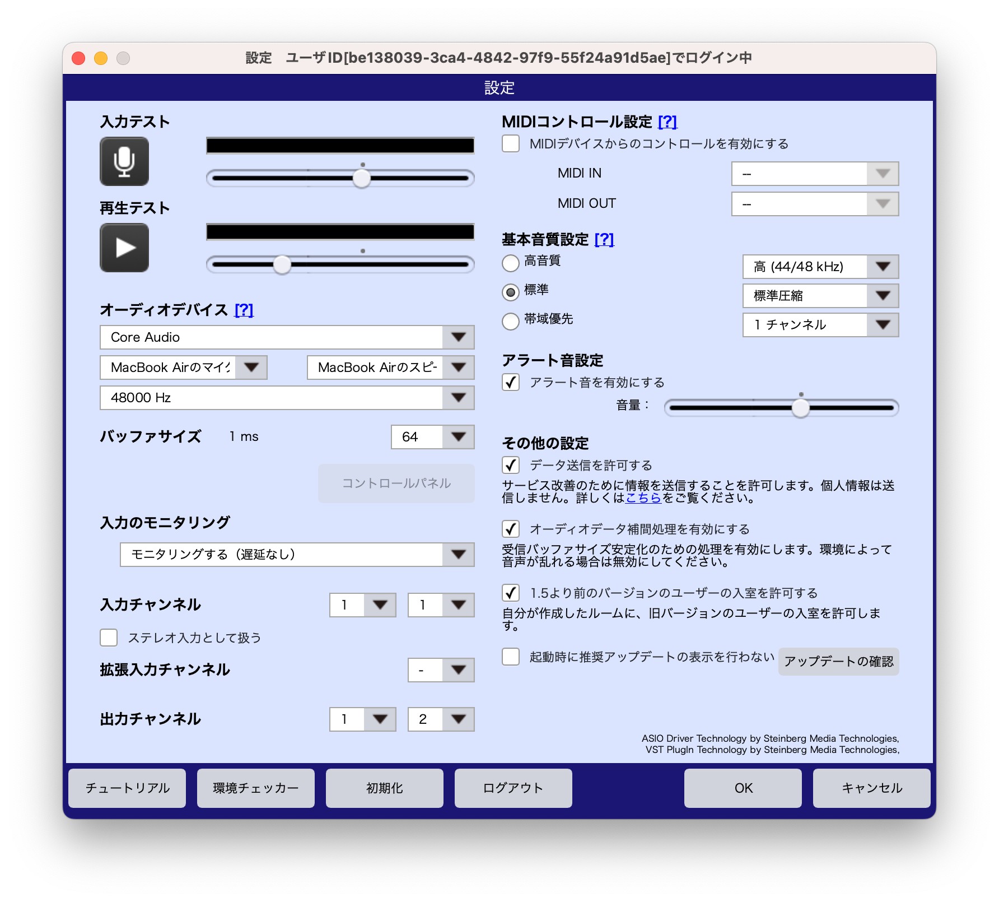
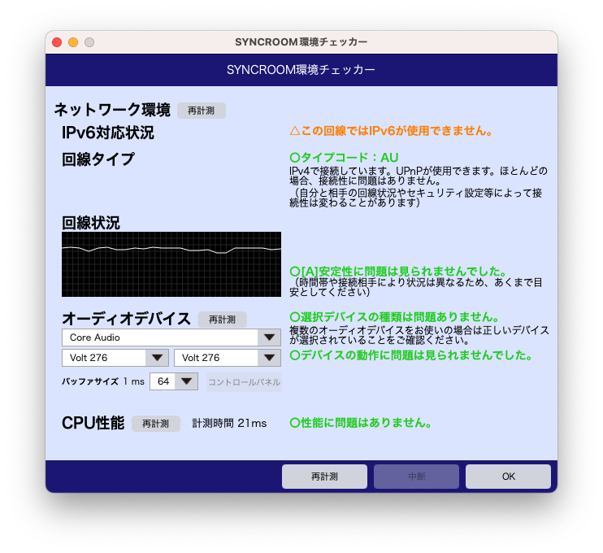

# Syncroom の調整方法
本稿は、Mac 版を前提としていますが、Windows版でも読み替え可能と思います。インストールや設定などはひととおり終わっている前提です。  

## 1.「設定」のポイント
  

|No.|項目|推奨値|備考|
|---|---|---|---|
|01|オーディオデバイス|MacならCore Audio|WinならASIO|
|02|入力デバイス|オーディオインターフェイス|03と同じもの|
|03|出力デバイス|オーディオインターフェイス|02と同じもの|
|04|サンプリング周波数|48000Hz|オーディオインターフェイスの設定も48kHzに。|
|05|バッファサイズ|64|音が途切れる場合128、256と大きくして試す|
|06|入力のモニタリング|モニタリングする（遅延あり）|オーディオインターフェイスのダイレクトモニタリングは切る。|
|07|基本音質設定|高音質|帯域は使うが遅延にはさほど影響ない。|
|08|その他の設定|「オーディオデータ補間処理を有効にする」をオン|音が途切れる場合のみ、オフも試してみる。|
  

## 2.「環境チェッカー」のポイント
  

|No.|項目|推奨値|備考|
|---|---|---|---|
|01|IPv6対応状況|IPv6が使用できます|自分も接続相手も対応している場合のみIPv6で接続されます。|  
|02|回線タイプ|AU6またはAU|AU6（IPv6対応）がベスト|
|03|回線状況|A|BやCだと厳しい|
|04|オーディオデバイス|MacだとCore Audio|WinだとASIO|
|05|入力デバイス|例では「Volt276」|入出力を単一デバイスでする|
|06|出力デバイス|例では「Volt276」|入出力を単一デバイスでする|
|07|バッファサイズ|64|設定可能な最小値になっている。音が途切れる場合、128、256と大きくしてみる。|
|08|CPU性能|問題はありません||
  
  
## 3.接続相手との設定調整
1. セッションを始める前に、まず、個々の接続相手との「バッファサイズ」の最適値を探る必要がある。まずはお互いの「環境チェッカー」の結果を確認し、「設定」のバッファサイズを大きいほうに合わせる。（自動でそうなる？）
2. 音声や遅延が安定していて、遅延をさらに小さくしたい場合は、数値を小さくする。音声がプツプツと途切れたり、リズムがもつれる場合は、数値を大きくする。問題のない範囲で、一番小さい値に設定する。
3. 音声は、なるべくヘッドホンで聞く。Syncroom からの音のみを聞き、オーディオインターフェイスのダイレクトモニター音は切って聞かない。自分の出した音が最大で20ms遅れて聞こえるが、それを織り込んで演奏する。
4. それでも通信が乱れる場合は、「その他の設定」の「オーディオデータ補間処理を有効にする」をオフにすると改善する場合もある。（望み薄？）
5. 「メイン画面」で、「オーディオプレイヤー」や「メトロノーム」を鳴らすと、相手への送信の遅延時間をみて、その分先回り送信してくれる。この機能により、遅延なく同時に音を聞いている状態になるため、タイミングを合わせやすくなる。
6.  ひとつのROOMに最大で5人まで入れるが、接続は1対1であるため、通信品質は、接続相手ごとに異なってくる。ある相手との接続が不調で、他の相手との接続が好調である場合の原因は、自分とある相手との問題であり、他の相手には関係がない。
7.  接続品質は、自分と相手のうち、より低品質な設定のほうに合わせて調整される。高品質に接続するためには、双方が高品質設定としてある必要がある。
  

## 4.公式のマニュアル
- 公式マニュアル：
https://syncroom.yamaha.com/play/manual/index_pc.html
  
- FAQ：
https://syncroom.yamaha.com/play/faq/index_pc.html