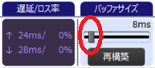
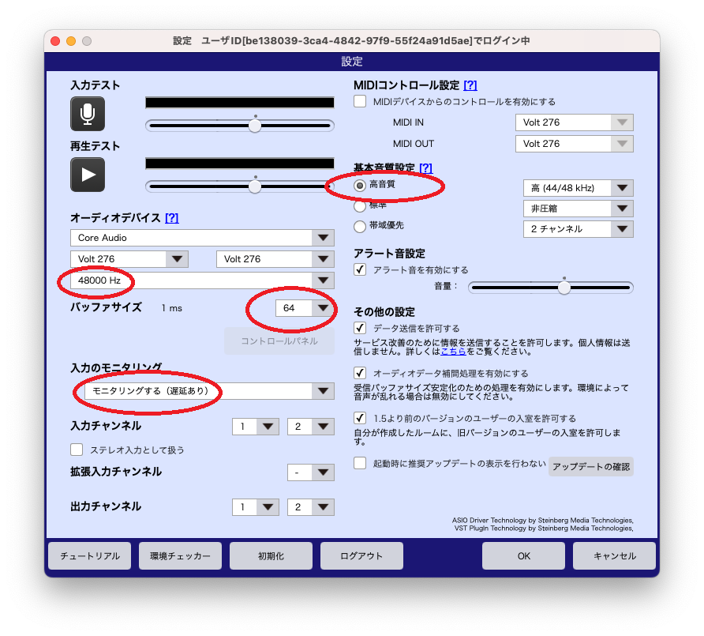
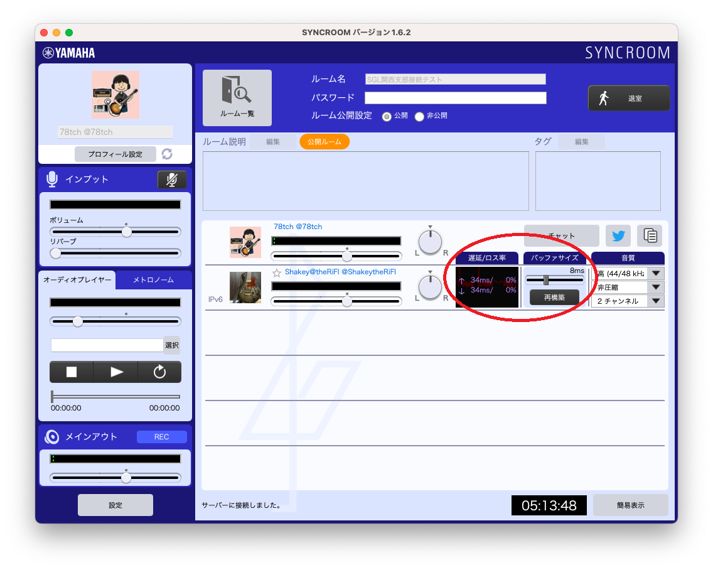

# Syncroom の調整方法
本稿は、Mac 版を前提としていますが、Windows版でも読み替え可能と思います。  
インストールや設定などはひととおり終わっている前提です。  
下の図は、双方がIPv6対応、LANケーブルで有線接続の環境で、音の途切れや遅延がなく、割とうまくいった場合の例です。遅延が送受信とも27ms、バッファサイズが3msとなっていることに注目してください。（遅延／ロス率の、上段↑が送信、下段↓が受信）

  
## 1.セッションするまでのおおまかな流れ
1. 環境を整える。（ネット環境、オーディオインターフェイス、Syncroomにログインなど）  
2. 「設定」画面を、次項で紹介する値にする。
3. 「環境チェッカー」で、次々項で紹介する結果と同等か確認する。
4. セッションする予定の人たちと、できれば事前に１対１で接続テストする。「音の途切れ」と「遅延のなさ」はトレードオフなので、バランスをみる。
5. 入室したら、「メンバー設定エリア」を「詳細表示」にし、遅延とバッファサイズを確認する。理想としては、遅延が送受信とも30ms以下、バッファサイズが5ms以下ぐらい。  

6. ルームには5人まで入れるが、それぞれの接続相手に対してP2P接続が張られるので、通信品質は全体で共通ではなく、それぞれの接続相手ごとに自動で調節・設定される。音が途切れる相手がいる場合、「設定」画面で全体の設定を変更するのではなく、「メイン」画面で音が途切れる接続相手の「バッファサイズ」のスライダーを右にずらすことで、個別に調節する。10msぐらいにして途切れなくなるか確認し、途切れなければもう少し小さくし、途切れたらもっと大きく、と調節し、途切れないなかで最小にする。「再構築」ボタンを押せば、自動で再調整される。  
7. 相手とタイミングを合わせる工夫その１：「自分の演奏した音」も、Syncroomからの返り音でモニターする。そのためには、入力のモニタリング設定を「モニタリングする（遅延あり）」とし、オーディオインターフェイスのダイレクトモニター機能はオフにしておく。ヘッドホンで聞くとやや遅延が少ない。
8. 相手とタイミングを合わせる工夫その２：「オーディオプレイヤー」や「メトロノーム」の音は、遅延時間を織り込んで先回り送信されるため、相手と同一時刻に聞こえる。そのためその音をガイドにすると、相手とタイミングが合いやすい。（ただし、メトロノームは時々テンポがゆらぐ？気のせい？）
  
## 2.「設定」画面のポイント

  
|No.|項目|推奨値|備考|
|---|---|---|---|
|01|オーディオデバイス|MacならCore Audio|WinならASIO|
|02|入力デバイス|オーディオインターフェイス|03と同じもの|
|03|出力デバイス|オーディオインターフェイス|02と同じもの|
|04|サンプリング周波数|48000Hz|オーディオインターフェイスにも設定があれば、48kHzに。|
|05|バッファサイズ|64|音が途切れる相手との調節はメイン画面のスライダーでする。|
|06|入力のモニタリング|モニタリングする（遅延あり）|オーディオインターフェイスのダイレクトモニタリング機能は切る。|
|07|基本音質設定|高音質|帯域は使うが遅延にはさほど影響ない。|
|08|その他の設定|「オーディオデータ補間処理を有効にする」をオン|参加者全員の音が途切れる場合のみ、オフも試してみる。|
  
## 3.「環境チェッカー」結果のポイント
  

|No.|項目|推奨値|備考|
|---|---|---|---|
|01|IPv6対応状況|IPv6が使用できます|IPv6で接続されるのは、自分も接続相手もIPv6に対応している場合のみ。|  
|02|回線タイプ|AU6またはAU|AU6（IPv6対応）がベスト。|
|03|回線状況|A|BやCだと厳しい|
|04|オーディオデバイス|MacだとCore Audio|WinだとASIO|
|05|入力デバイス|例では「Volt276」|入出力を単一デバイスでする|
|06|出力デバイス|例では「Volt276」|入出力を単一デバイスでする|
|07|バッファサイズ|64|実際の接続時には自動調整されるので、64に固定でよい。|
|08|CPU性能|問題はありません||
  
  
## 4.接続相手との設定調整
  
  

1. 相手が入室すると、「メンバー設定エリア」に相手が表示される。自分が主催の場合、相手を強制退室させられる「ばつボタン」が表示される。
2. 標準では、「簡易表示」になっており、「遅延／通信状況」が青黄橙赤の４段階で、音質が星３個の３段階などで表示されている。右下の「詳細表示」ボタンを押すと「詳細表示」に切り替わる。「詳細表示」が推奨。
3. 「詳細表示」にすると、「遅延／ロス率」「バッファサイズ」「音質」が表示される。「遅延／ロス率」は上段が送信、下段が受信。それぞれ、20ms以下、0％程度がよい。「バッファサイズ」は、1～5ms程度がよい。「音質」は「高音質（高（44/48kHz）、非圧縮、2チャンネル）」がよい。
4. バッファサイズは、接続時に自動的に最適な値に調整されるが、「再構築」ボタンを押すと、再度自動調整される。原則的に自動設定に任せればよいが、音の途切れが気になる相手のみ、「バッファサイズ」のスライダーを音が途切れなくなるところまで右に動かして手動設定する。
5. 音声や遅延が安定していて、遅延をさらに小さくしたい場合は、「設定」画面の「バッファサイズ」の数値を64からさらに小さく32などにする。ただし実際の接続時には、自動的に調節して設定される。
6. 音声は、なるべくヘッドホンで聞く。自分の演奏の音も、オーディオインターフェイスのダイレクトモニター機能は切って、Syncroom から出る音のみを聞きく。これにより自分の出した音が最大で20ms遅れて聞こえるが、それを織り込んで演奏する。
7.  それでも通信が乱れる場合は、「その他の設定」の「オーディオデータ補間処理を有効にする」をオフにすると改善する場合もある。（望み薄？）
8.  「メイン画面」で、「オーディオプレイヤー」や「メトロノーム」を鳴らすと、相手への送信の遅延時間をみて、その分先回り送信してくれる。この機能により、遅延なく同時に音を聞いている状態になるため、タイミングを合わせやすくなる。
9.  ひとつのROOMに最大で5人まで入れるが、接続は1対1であるため、通信品質は、接続相手ごとに異なってくる。ある相手との接続が不調で、他の相手との接続が好調である場合の原因は、自分とある相手との問題であり、他の相手には関係がない。
10. 音質は、自分と相手のうち、より低音質な設定のほうに合わせて調整される。遅延にはあまり影響がないらしいので、原則的には全員が「高音質」に設定すればよい。サンプリング周波数は44か48しかないが、これはそれぞれの設定に合わせて変換される。
  

## 5.公式のマニュアル
- 公式マニュアル：
https://syncroom.yamaha.com/play/manual/index_pc.html
  
- FAQ：
https://syncroom.yamaha.com/play/faq/index_pc.html
  
- 遅延時間の目安：  
あくまでも目処となる数値ですが、以下を目安にしてください。  
30msec以下：ある程度の音楽セッションが実現できます。  
45msec以下：リズムトラックに合わせて演奏する程度のことが可能です。  
70msec以下：オケに合わせて歌をうたう程度のことが可能です。  
  
- 音が乱れる場合：  
インターネットの通信が不安定な状況かもしれません。その場合は『メンバー設定エリア』の『詳細表示』画面の『バッファサイズ』を大きくしてみましょう。ただし、バッファサイズを大きくすると遅延は大きくなります。  
『設定』の『基本音質設定』において、『非圧縮』または、『高圧縮』を選ぶことで改善します（なお、相手側の設定も必要です）。  
  
- 自分の列のレベルメーターが振れません。  
『メンバー設定エリア』の自分の列にあるレベルメーターは、「自分がモニターする音量」を示しています。そのため、『設定』の『入力のモニタリング』が『モニタリングしない』になっていると振れません。  
ご自身の入力レベルは『インプット』のレベルメーターでご確認ください。  
  
- 「ルームに入る」のボタンが押せません。：  
ルームに入るにはご自身の「ニックネーム」と「ルーム名」の入力が必須となります。  
「ルームに入る」ボタンがグレーアウトしている場合は、各項目に入力不備がないかご確認ください。  

## 6.おまけ（無線LANを試してみた）
有線接続が推奨ではありますが、スマホ版もあったりするので、無線LANだとどの程度なのか、試してみました。  
１対１で、片方だけ無線LANにすると、自動調整の設定では音が途切れたため、スライダーでバッファサイズを調整しました。無理にバッファサイズを小さくすると、かえって遅延が大きくなりました。「遅延」の「ms」が一番小さくなるように調節します。  
|No.|条件|遅延|バッファサイズ|体感|
|---|---|---|---|---|
|01|双方IPv6有線|25ms前後|3ms前後（自動設定）|遅延は気にならず、音質もよい。|  
|02|IPv6有線<>IPv6無線LAN|35ms前後|8ms（手動設定）|音が途切れたりリズムが揺らいだりするが、なんとか呼吸を合わせられる。|  
  

